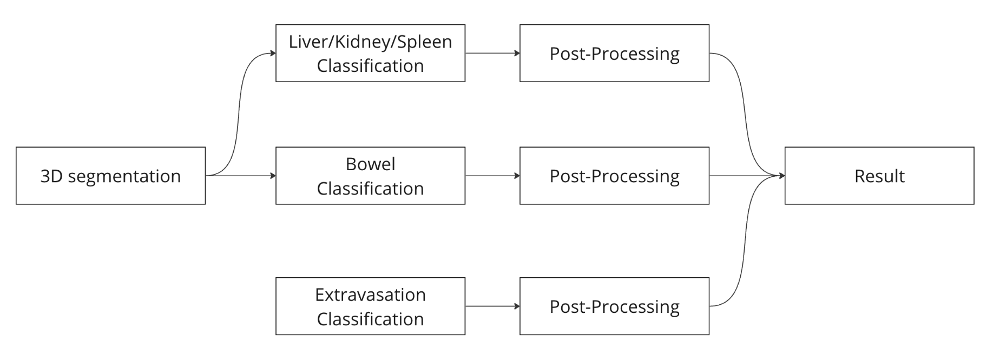

# rsna2023atd_9th_solution
9th place solution by '[Rist] Happy1650🍽️' in the Kaggle competition 'RSNA 2023 Abdominal Trauma Detection'



The detailed explanation of the solution and the inference notebook can be found [here](https://www.kaggle.com/competitions/rsna-2023-abdominal-trauma-detection/discussion/447506). Please refer to it.


# Installation
```
docker compose up -d
```
Please extract the dataset provided on Kaggle in the 'data/' directory with the original directory structure.


# Entrypoints
Execute the scripts in numerical order based on the file and directory names due to the intermediate file dependencies.

Please refer to [entry_points.md](./entry_points.md)

# Hardware/Software
|  | Spec |
| --- | --- |
| CPU | AMD Ryzen Threadripper PRO 5975WX 32-Cores |
| Memory | 256 GB |
| GPUs | 2x RTX 6000 Ada |
| OS | Ubuntu 22.04 |
| OS drive | 2TB SSD |

Development Environment: [Docker](./Dockerfile)

# Result

### CV
| | bowel | ev | kidney | liver | spleen | any_injury | |
| --- | --- | --- | --- | --- | --- | --- | --- |
| w/o Post-Processing | 0.1293 | 0.5348 | 0.3146 | 0.4192 | 0.4454 | 0.5533 | 0.3994 |
| w/ Post-Processing | 0.1293 | 0.5303 | 0.3141 | 0.4190 | 0.4485 | 0.4925 | 0.3889 |

### LB
| Public | Private |
| --- | --- |
| 0.45894 | 0.41962 |


# Reference
- https://www.kaggle.com/competitions/rsna-2023-abdominal-trauma-detection/discussion/447506
